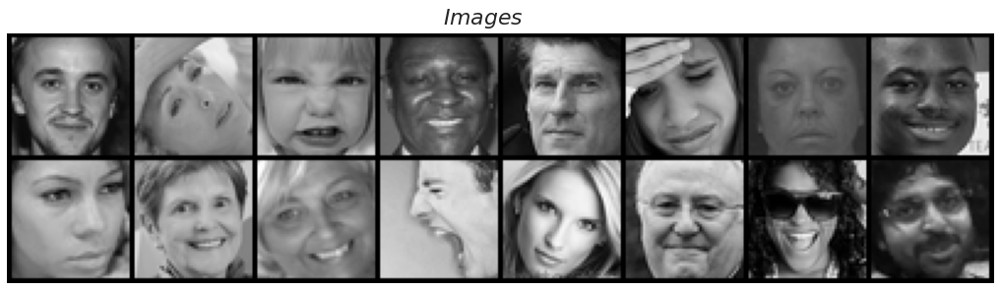

# Facial Expression Recognition using PyTorch

Hello everyone, I hope you are doing well during these time. In this project, we're going to look at how to build a **facial expression recognition** project from scratch using PyTorch. We'll start from simple task such as downloading dataset, dataset preparation to writing our own custom CNN and a build a ResNet-9 for our use case. We'll also experiment with different learning rate schedulers. Hope you enjoy it.

- Blog Post detailing steps: [github pages](https://veb-101.github.io/Facial-Expression-Recognition/)
- Jupyter notebook (hosted on jovian.ml) -> [Facial Expression Recognition using PyTorch](https://jovian.ml/vaibhav-singh-3001/facial-expression-recognition)
