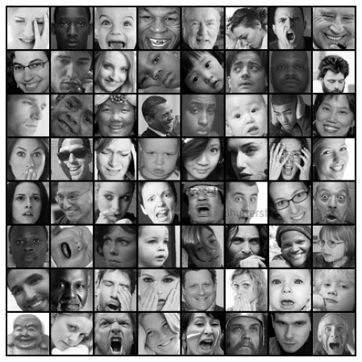

# Facial Expression Recognition using PyTorch

Hello everyone, I hope you are doing well during these time. In this post, we're going to look at how to go on about building a **facial expression recognition** project from scratch using PyTorch. In this post we'll start from simple task such as downloading dataset, dataset preparation to writing our own custom CNN and a build a ResNet-9 for our use case. We'll also experiment with differnt learning rate schedulers. This article assumes you the basic knowledge of PyTorch. Hope you enjoy it as much as I did while doing it.

This post is a part of my final project for the free course provided by [jovian.ml - Pytorch: zero to gans](https://jovian.ml/forum/t/start-here-welcome-to-deep-learning-with-pytorch-zero-to-gans/1622).

## Table of Content

1. Introduction
2. Importing modules
3. Dataset Preparation
4. Augmentaions
5. Building Dataloader
6. Setup GPU
7. Model Building
   1. Parent Class and Metrics
   2. Models
      - ResNet9
      - Custom CNN model
8. Training and Testing Helper Functions
9. Training
10. Training plots
11. Tests
12. Summary

### 1. Introduction

The **goal** of Facial Expression Recognition is to classify the expressions on face images into various categories such as anger, fear, surprise, sadness, happiness and so on. Specifically we are going to classify are datasets into 7 categories such as:

<iframe src="https://jovian.ml/embed?url=https://jovian.ml/vaibhav-singh-3001/facial-expression-recognition/v/4&cellId=6" title="Jovian Viewer" height="248" width="850" frameborder="0" scrolling="auto"></iframe>

The dataset used for this project can be downloaded from [here](https://www.kaggle.com/ashishpatel26/fer2018). This dataset consists of `48x48` pixel grayscale images of faces. The faces have been automatically registered so that the face is more or less centered and occupies about the same amount of space in each image.

### 2. Importing modules

<iframe src="https://jovian.ml/embed?url=https://jovian.ml/vaibhav-singh-3001/facial-expression-recognition/v/4&cellId=4" title="Jovian Viewer" height="668" width="850" frameborder="0" scrolling="auto"></iframe>

### 3. Dataset Preparation

Now that we know the goal of this project, let's start with the very first step of any machine learning project i.e. preparing our dataset. After downloading the data, we can see that our data is in a `.csv` file. To use this .csv file we can use the `Pandas` function **read_csv(..)** to load the data into memory.

<iframe src="https://jovian.ml/embed?url=https://jovian.ml/vaibhav-singh-3001/facial-expression-recognition/v/4&cellId=7" title="Jovian Viewer" height="357" width="850" frameborder="0" scrolling="auto"></iframe>

We can see that our .csv file contains 3 columns:

1. **emotion** - contains integer values representing one of 7 emotions.
2. **pixels** - each row contains a string of pixel values seperated by spaces 2304 (48x48) pixel values.
3. **Usage** - it contains 3 unique values `Traininig`, `PrivateTest`, `PublicTest`. It states which rows are to be used for training and testing purpose.

We're going to combine together the `Training` and `PublicTest` rows and use them as **training and validation set**, splitted in an **80-20** proportion. We'll use the `PrivateTest` rows as our **test** dataset.

Taking a quick peek at the `emotion` column we can have see that there is heaby class imbalance in our dataset. To remedy this, we'll use different data transformations techniques available in pytorch.

<iframe src="https://jovian.ml/embed?url=https://jovian.ml/vaibhav-singh-3001/facial-expression-recognition/v/4&cellId=16&hideInput=true" title="Jovian Viewer" height="550" width="850" frameborder="0" scrolling="auto"></iframe>

One more thing what we can do is merge the `Angry` and `Disgust` class into one as both as highly related.
We can do so by:

<iframe src="https://jovian.ml/embed?url=https://jovian.ml/vaibhav-singh-3001/facial-expression-recognition/v/4&cellId=17" title="Jovian Viewer" height="185" width="850" frameborder="0" scrolling="auto"></iframe>

Now, update the emotions dictionary.

<iframe src="https://jovian.ml/embed?url=https://jovian.ml/vaibhav-singh-3001/facial-expression-recognition/v/4&cellId=18" title="Jovian Viewer" height="268" width="850" frameborder="0" scrolling="auto"></iframe>

Let's first extract the pixel values for each row from **pixels** column.
**Steps:**

1. Iterate over each row to access the _str_ value.
2. use the _.split()_ method to split the string on spaces creating a list.
3. Iterate over each value in the list convert them to _int_ and then finally append the whole list of integers in a list named **pixels**.
4. Convert the list to a numpy array.
5. Rescale the pixel values by dividing by **255.0**
6. Drop the original pixels column.
7. Add the pixels array created as a column back in the dataset.

<iframe src="https://jovian.ml/embed?url=https://jovian.ml/vaibhav-singh-3001/facial-expression-recognition/v/4&cellId=11" title="Jovian Viewer" height="588" width="850" frameborder="0" scrolling="auto"></iframe>

Doing so our dataset dataframe object will now contain **2306 rows**, with 2304 columns for _pixels_, 1 for _emotion_ and 1 for _Usage_.

Finally now we can now create our **cusotm Dataset** class that will come in handy for applying data augmentation and for building our dataloaders. Here we are simply defining methods that will on each call by the **Dataloader** help in retreiving the labels **y** i.e. the emotion and the pixel values i.e. our **X** values reshaped as a 48x48 matrix as a single tuple of **(X, y)**. Doing this, we can freely define our augmentation methods without worrying about the implementation details as the augmentation for each image can be directly applied during a call.

<iframe src="https://jovian.ml/embed?url=https://jovian.ml/vaibhav-singh-3001/facial-expression-recognition/v/4&cellId=14" title="Jovian Viewer" height="585" width="850" frameborder="0" scrolling="auto"></iframe>

### 4. Augmentations

There's a whole list of different augmenations we can apply to our images they can be found [here.](https://pytorch.org/docs/stable/torchvision/transforms.html)

For this project I chose to go with some basic augmentaions such as:

1. RandomCrop: It is used to crop the PIL image at a random location.
2. RandomRotation: rotate the image.
3. RandomAffine: it applies a suite of random affine transformation of the image keeping center invariant.
4. RandomHorizontalFlip: horizontal flip of the image.
5. ToTensor: convert the PIL image to a pytorch tensor.

Note that, in every machine learning task we apply transformations only to the training set and not the validation or test set with exception such as normalization, converting to tensors. This is because we want to pretend that the validation & test data are **new, unseen data.** We use the validation & test dataset to get a good estimate of how our model performs on any new data.

From [quora](https://qr.ae/pNKZAC)

> "The training and testing data should undergo the same data preparation steps or the predictive model will not make sense. This means that the number of features for both the training and test set should be the same and represent the same thing. If your input is an image and you did pre-processing steps like resizing, background subtraction, normalization, etc, the same steps should be done to the test set. If you did data transformation, such as PCA, random projection etc, then the test set must be transformed using the parameters of the training set and then passed to the classifier."

<iframe src="https://jovian.ml/embed?url=https://jovian.ml/vaibhav-singh-3001/facial-expression-recognition/v/4&cellId=20" title="Jovian Viewer" height="685" width="850" frameborder="0" scrolling="auto"></iframe>
<iframe src="https://jovian.ml/embed?url=https://jovian.ml/vaibhav-singh-3001/facial-expression-recognition/v/4&cellId=28" title="Jovian Viewer" height="744" width="850" frameborder="0" scrolling="auto"></iframe>

### 5. Building Dataloader

Straight from the documentaion:

> Combines a dataset and a sampler, and provides an iterable over the given dataset.
> The DataLoader supports both map-style and iterable-style datasets with single or multi-process loading, customizing loading order and optional automatic batching (collation) and memory pinning.

We'll create 3 helper functions to fetch dataset and return dataloader for each set:

1. **get_train_dataset(..)**
2. **get_train_dataloader(..)**
3. **get_test_dataloader(..)**

<iframe src="https://jovian.ml/embed?url=https://jovian.ml/vaibhav-singh-3001/facial-expression-recognition/v/4&cellId=22" title="Jovian Viewer" height="685" width="850" frameborder="0" scrolling="auto"></iframe>

<iframe src="https://jovian.ml/embed?url=https://jovian.ml/vaibhav-singh-3001/facial-expression-recognition/v/4&cellId=23" title="Jovian Viewer" height="465" width="850" frameborder="0" scrolling="auto"></iframe>

<iframe src="https://jovian.ml/embed?url=https://jovian.ml/vaibhav-singh-3001/facial-expression-recognition/v/4&cellId=24" title="Jovian Viewer" height="565" width="850" frameborder="0" scrolling="auto"></iframe>

### 6. Setup GPU

To use the power of GPU's we have to first move our data and models that we're going to create onto the availavble gpu.
We can do this with by:

1. Create a recursive function `to_device` that iterates over the passed data and loads it into GPU memory.
2. Create a class `DeviceDataLoader` that wraps our dataloader and uses the recursive function to move the data to GPU when accessed.

<iframe src="https://jovian.ml/embed?url=https://jovian.ml/vaibhav-singh-3001/facial-expression-recognition/v/4&cellId=30" title="Jovian Viewer" height="625" width="850" frameborder="0" scrolling="auto"></iframe>

Get the current device in use:

<iframe src="https://jovian.ml/embed?url=https://jovian.ml/vaibhav-singh-3001/facial-expression-recognition/v/4&cellId=31" title="Jovian Viewer" height="138" width="850" frameborder="0" scrolling="auto"></iframe>

### 7. Model Building

Finally, we've arrived to the exiting part everyone likes, the **Building models**. For this project I used two models:

- A ResNet9 model
- Custom CNN model from scratch.

We'll divide this section into two parts:

1. Creating a BaseClass and metrics.
2. Defining two seperate model classes: ResNet9 and custom CNN Model.

#### 7.1 Parent Class and Metrics

Parent Class by definition means a class that contains some properties or methods that common to all the inhereting child classes. For our use case we'll create an `ImageClassificationBase` class that itself inherits from the `nn.Module` class from PyTorch. This class will contain some methods that can be used by the child classes such as:

1. `training_step` - method used to perform operations during the training step for the model.
2. `validation_step` - methods used to evaluate our model on the validation set.
3. `get_metrics_epoch_end` - contains operations that when called after training or validation step for a single epoch, returns the metrics such as **accuracy**, **loss**, **val_accuracy**, **val_loss**.
4. `epoch_end` - prints the current epoch metrics.

The great thing about this class is that it can be used for any image classification problem in PyTorch with little to no updation necessary.

<iframe src="https://jovian.ml/embed?url=https://jovian.ml/vaibhav-singh-3001/facial-expression-recognition/v/4&cellId=34" title="Jovian Viewer" height="745" width="850" frameborder="0" scrolling="auto"></iframe>

**Metric**: Using the good old `accuracy`.

<iframe src="https://jovian.ml/embed?url=https://jovian.ml/vaibhav-singh-3001/facial-expression-recognition/v/4&cellId=36" title="Jovian Viewer" height="145" width="850" frameborder="0" scrolling="auto"></iframe>

#### 7.2 Models

##### 7.2.1 ResNet9

ResNets architectures by design uses skip connections in residual blocks, because of these skip connections, we can propagate larger gradients back to initial layers avoiding vanishing gradients and these layers also could learn as fast as the final layers, giving us the ability to train deeper networks.

Here, I've updated the default ResNet9 architecture to accomodate for the fact that we have a grayscale dataset.
We can simply do thid by updating the in and out channels in each `conv_block`, I've also added an additional `Linear` layer classifier block.

(open the image in a new tab and hover over the blocks to see how they are defined.)

Building block of our ResNet9 architecture:

<iframe src="https://jovian.ml/embed?url=https://jovian.ml/vaibhav-singh-3001/facial-expression-recognition/v/4&cellId=38" title="Jovian Viewer" height="305" width="850" frameborder="0" scrolling="auto"></iframe>

The **ResNet9 model** class:

<iframe src="https://jovian.ml/embed?url=https://jovian.ml/vaibhav-singh-3001/facial-expression-recognition/v/4&cellId=39" title="Jovian Viewer" height="800" width="850" frameborder="0" scrolling="auto"></iframe>

##### 7.2.1 Custom CNN model

Let's build a **CNN model** to compare with the ResNet9 model

<iframe src="https://jovian.ml/embed?url=https://jovian.ml/vaibhav-singh-3001/facial-expression-recognition/v/4&cellId=41" title="Jovian Viewer" height="800" width="850" frameborder="0" scrolling="auto"></iframe>

In both of these classes we can see a `forward` method. This method is called by the `training_step` method of the _BaseClass_ using `self(inputs)`. This is because when we inherited the `nn.Module` class in the _BaseClass_, it expects the `forward` method in it to be overriden. Doing so provide us with the functionality to directly call the model (self) and pass it any arguments like `self(inputs)`, it'll internally call the model's forward method and pass it input parameters. We can then choose what we want to do within `forward` method as seen in both the _ResNet9_ class and _EmotionRecognition_ class.

### 8. Training and Testing Helper Functions

We're nearly at the end of project but first we need to define some helper functions to tie together all the above defined functions and classes.

1. Create `fit_model` function which is reponsible for training and saving the best model.
2. Create a `evaluate` function for evaluating the validation set.
3. A `load_best` helper function to load our best model for evaluating the test set.
4. A `generate_prediction` function for generating predictions on the test set using the best model.
5. Plotting methods
6. A `end-to-end` function that binds all these functions in a simple single call requiring the name of the model to use and training parameters as a dictionary.

- **Functions:** `evaluate`, `fit_model`
<iframe src="https://jovian.ml/embed?url=https://jovian.ml/vaibhav-singh-3001/facial-expression-recognition/v/4&cellId=44" title="Jovian Viewer" height="800" width="850" frameborder="0" scrolling="auto"></iframe>

- **Functions:** `load_best` and `generate_predictions`
<iframe src="https://jovian.ml/embed?url=https://jovian.ml/vaibhav-singh-3001/facial-expression-recognition/v/4&cellId=45" title="Jovian Viewer" height="800" width="850" frameborder="0" scrolling="auto"></iframe>

- **Functions:** `plotting`
<iframe src="https://jovian.ml/embed?url=https://jovian.ml/vaibhav-singh-3001/facial-expression-recognition/v/4&cellId=47" title="Jovian Viewer" height="725" width="850" frameborder="0" scrolling="auto"></iframe>

- **Functions:** `end-to-end`
<iframe src="https://jovian.ml/embed?url=https://jovian.ml/vaibhav-singh-3001/facial-expression-recognition/v/4&cellId=46" title="Jovian Viewer" height="800" width="850" frameborder="0" scrolling="auto"></iframe>

### 9. Training

#### 9.1 Models

<iframe src="https://jovian.ml/embed?url=https://jovian.ml/vaibhav-singh-3001/facial-expression-recognition/v/4&cellId=49" title="Jovian Viewer" height="165" width="850" frameborder="0" scrolling="auto"></iframe>

#### 9.2 Training Parameters

<iframe src="https://jovian.ml/embed?url=https://jovian.ml/vaibhav-singh-3001/facial-expression-recognition/v/4&cellId=51" title="Jovian Viewer" height="228" width="850" frameborder="0" scrolling="auto"></iframe>

#### 9.3 Train model

<iframe src="https://jovian.ml/embed?url=https://jovian.ml/vaibhav-singh-3001/facial-expression-recognition/v/4&cellId=52" title="Jovian Viewer" height="800" width="850" frameborder="0" scrolling="auto"></iframe>

### 10. Training Plots

<iframe src="https://jovian.ml/embed?url=https://jovian.ml/vaibhav-singh-3001/facial-expression-recognition/v/4&cellId=54" title="Jovian Viewer" height="490" width="850" frameborder="0" scrolling="auto"></iframe>

### 11. Tests

| model               | LR         | Test accuracy |
| ------------------- | ---------- | ------------- |
| Emotion Recognition | None       | 0.659         |
| ResNet9 (current)   | None       | 0.651         |
| Resnet9             | OneCycleLr | 0.327         |
| Emotion Recognition | OneCycleLr | 0.26          |

### 12. Summary

We've covered a lot of ground in this tutorial. Here's quick recap of the topics:

1. Introduction to the Facial emotion recognition dataset for image classification.
2. Prepared our dataset dataframe and created a custom `dataset` class.
3. Applied Image augmentaions using `torch.transforms`.
4. We created our own helper functions to for fetching datasets and creating dataloaders.
5. We also created a wrapper `DeviceDataLoader` class for our `Dataloader` to move our data to the GPU.
6. We looked at how to use the `nn.Module` class and also created a `BaseClass` that can be used for any image classification model.
7. Created our own version of ResNet9 class and a custom CNN model for comparison.
8. Created various helper functions to tie different components together.
9. Finally we trained our model and plotted the training results.
